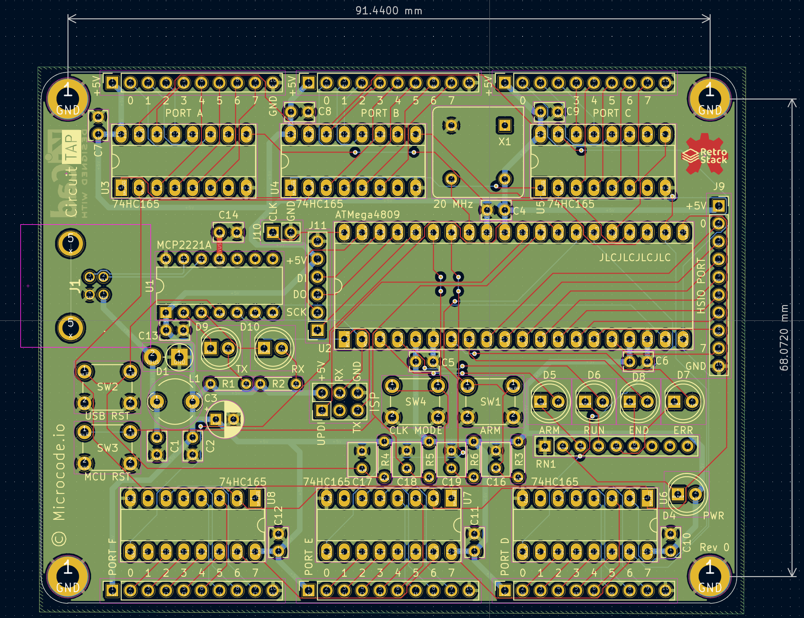

<!--
 Copyright 2023 Greg Coonrod
 
 Licensed under the Apache License, Version 2.0 (the "License");
 you may not use this file except in compliance with the License.
 You may obtain a copy of the License at
 
     http://www.apache.org/licenses/LICENSE-2.0
 
 Unless required by applicable law or agreed to in writing, software
 distributed under the License is distributed on an "AS IS" BASIS,
 WITHOUT WARRANTIES OR CONDITIONS OF ANY KIND, either express or implied.
 See the License for the specific language governing permissions and
 limitations under the License.
-->

# Circuit Tap

A low-speed digital logic analyzer designed around 74HC165 shift registers and the ATMega4809 MCU.

## Design

The Circuit Tap is designed to serve as a digital logic analyzer for primarily low speed circuits (<= 1Mhz). It is intended to aid in debugging the [RetroStack](https://github.com/gcoonrod/retro-stack), a 6502 based hobbyist computer. As I do not (at the time of designing this tool) own an oscilliscope or logic analyzer, I needed a way to monitor the address bus, data bus, and numerous control signals of the RetroStack while the clock was freely running. For very simple programs it was sufficient to use a manually stepped clock to debug, but the addition of IO peripherals and more complex programs have made it prohibitively time consuming to continue manual clock control.

### Data Capture

The Circuit Tap has 6 low speed 8-bit input ports and one full speed 8-bit port. The low speed ports are implemented with 74HC165 parallel load shift registers which allows for the simultaneous capture of up to 48 signals on a single clock transition. However, those bits must be shifted out before (~10 mcu clock cycles) before another sample can be taken. This is the primary limiting factor for the sampling speed of the low speed inputs. The full speed port is directly mapped to Port D of the 4809 and can be read from or written to as fast as the mcu is capable.

### Goals

- Reliably capture signals at ~1Mhz
- Read test plans from an SD card or UART
- Write test results to SD or UART
- Integrate with desktop GUI (TBD)
- Drive external clock and control lines
- Trigger off external clock and control lines
